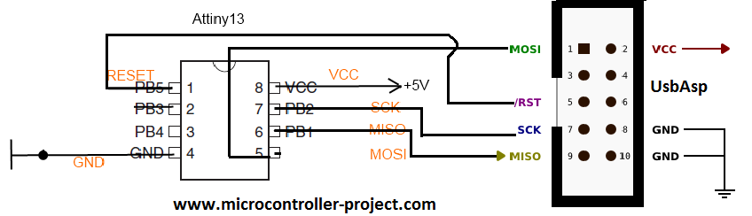

# AVR Projekt

_Nejedna se o novy projekt ale o zalohu neceho, co jsem driv zkousel._

Taková kostra pro AVR pojekt s Attiny

## Součásti

- ATtiny13A
- USB programátor USBasp
   - https://www.fischl.de/usbasp/
   - https://dratek.cz/arduino/943-programator-usb.html?gad_source=1&gad_campaignid=17190055571
- pár rezistorů, kondenzátorů, repráček
- nepájivé plošné pole
- spojovací drátky

Třeba něco jako: https://dratek.cz/arduino/51568-rozsirujici-sada-nepajive-pole-a-vodice.html?gad_source=1&gad_campaignid=21656222776

## Zapojení programátoru

